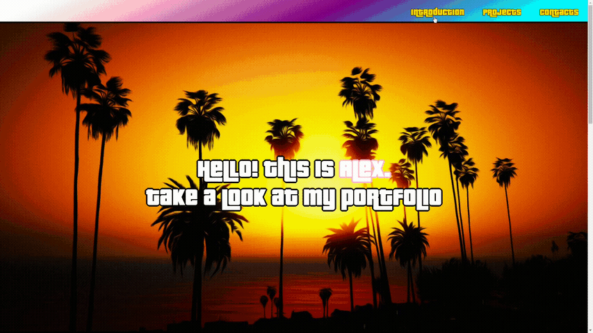

# GTA Portfolio City 
> Personal portfolio landing made in GTA Vice City style
> 
<a href="https://username1111111111.github.io/GTA-Portfolio-City/">Live demo here</a>

> 
Or 👇:

## Table of Contents
* [General Info](#general-information)
* [Highlights](#highlights)
* [Screenshots](#screenshots)
* [Usage](#usage)
* [Contact](#contact)

## General Information
- This was done as a FreeCodeCamp graduate project
- It was intended for GTA Vice City styling, cool looking animation and bold color combinations
- It is pretty outdated, since, as of now, portfolio is much larger

## Highlights
- SCSS ✨
- Fontawesome
- Flexbox layout
- Cool looking on hover grdient glowing animation 🔥
- Custom font import and usage
- Added nice looking border to font
- Browser bottom-left bar link hiding via JS
- First time used normalize.css, reset.css
- Desktop-first layout (media queries) ✔️

## Screenshots

## Usage
Just clone the repo and open **index.html** in a browser 👍

## Contact

<a style="text-decoration: none;"href="https://github.com/Username1111111111/Username1111111111">@Username1111111111</a>
 
  
The Frontend developer 

   💪

